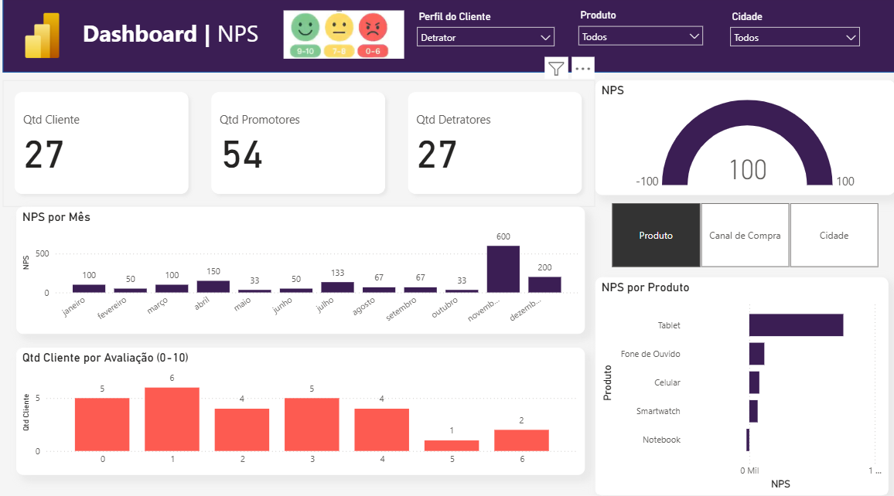

# 📊 Dashboard de NPS | Power BI

## 📌 Sobre o Projeto

Este projeto consiste em um dashboard interativo desenvolvido no **Power BI** para análise do **Net Promoter Score (NPS)**.

O objetivo é fornecer uma visão clara da satisfação dos clientes por meio de indicadores, gráficos e filtros interativos, facilitando a tomada de decisão baseada em dados.

---

## 🚀 Funcionalidades

- 📈 Indicador geral de NPS (-100 a 100)
- 👥 Quantidade total de clientes
- 🟢 Quantidade de Promotores
- 🔴 Quantidade de Detratores
- 📅 Evolução do NPS por mês
- ⭐ Distribuição das avaliações (0 a 10)
- 📦 NPS por Produto
- 🏙️ Análise por Cidade
- 🛒 Análise por Canal de Compra
- 🎯 Segmentação por Perfil do Cliente
- 🎛️ Filtros totalmente interativos

---

## 📊 Classificação do NPS

| Nota | Categoria |
|------|-----------|
| 9 - 10 | 🟢 Promotores |
| 7 - 8 | 🟡 Neutros |
| 0 - 6 | 🔴 Detratores |

### Fórmula

```text
NPS = (% Promotores - % Detratores) × 100
```

O resultado varia entre **-100 e 100**.

---

## 📷 Dashboard

[]

---

## 📌 KPIs Disponíveis

- Quantidade de Clientes
- Quantidade de Promotores
- Quantidade de Detratores
- NPS Geral
- NPS por Produto
- Evolução Mensal do NPS
- Distribuição das Avaliações

---

## 🎛️ Filtros

O dashboard permite analisar os dados utilizando:

- Perfil do Cliente
- Produto
- Cidade
- Canal de Compra

Todos os visuais são dinâmicos e interativos.

---

## 🛠️ Tecnologias Utilizadas

- Power BI
- DAX
- Power Query
- Modelagem de Dados
- ETL

---

## 📈 Objetivos do Projeto

- Aplicar conceitos de Business Intelligence.
- Construir indicadores estratégicos.
- Desenvolver medidas em DAX.
- Criar dashboards interativos.
- Transformar dados em informações para apoio à tomada de decisão.

---

## 💡 Aprendizados

Durante o desenvolvimento deste projeto foram aplicados conceitos de:

- Modelagem de Dados
- Medidas em DAX
- Segmentação de Dados
- KPI
- Storytelling com Dados
- Visualização de Dados
- Boas práticas em Power BI

---

## 📥 Instalação

Para clonar este repositório e acessar o projeto:

```bash
git clone https://github.com/rjunio98/dash-marketing-nps
cd dash-marketing-nps
```